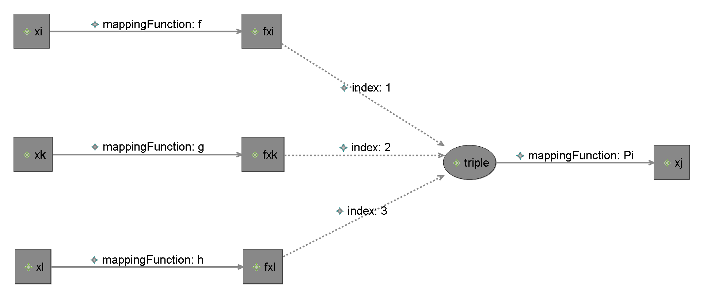
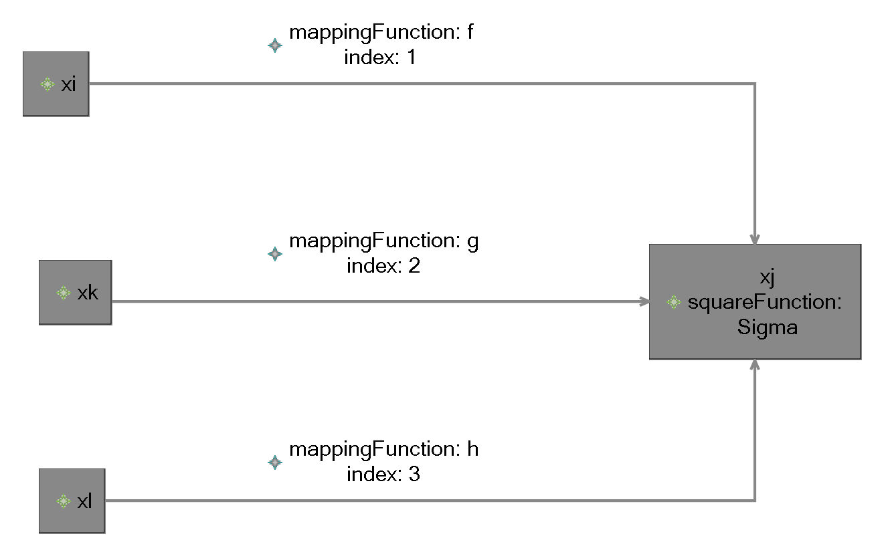

# Computational Hypergraphs

## 1 Original formulation & example

[computational-hypergraph1 Vocabulary](vocabulary/src/main/oml/caltech.edu/discipline/computational-hypergraph/computational-hypergraph1.oml):

```oml
vocabulary <http://caltech.edu/discipline/computational-hypergraph/computational-hypergraph1#> as computational-hypergraph1 {
  
  extends <http://purl.org/dc/elements/1.1/> as dc
  extends <http://www.w3.org/2001/XMLSchema#> as xsd
  extends <http://www.w3.org/2000/01/rdf-schema#> as rdfs
  
  @rdfs:label "Variable"
  @rdfs:comment "Corresponds to $\V$"
  concept Variable
  
  @rdfs:label "Square Variable"
  @rdfs:comment "Corresponds to $\V_{\square}$"
  concept SquareVariable :> Variable
  
  @rdfs:label "Circle Variable"
  @rdfs:comment "Corresponds to $\V_{\circle}$"
  concept CircleVariable :> Variable
  
  @rdfs:label "Edge"
  @rdfs:comment "Corresponds to $\CE$"
  relation entity Edge [
    from Variable
    to Variable
    forward edge
    functional
    inverse functional
  ]
  
  relation entity AggregationEdge :> Edge [
    from Variable
    to CircleVariable
    forward aggregation
  ]
  
  scalar property index [
    domain AggregationEdge
    range xsd:int
  ]
  
  relation entity MappingEdge :> Edge [
    from Variable
    to SquareVariable
    forward mapping
  ]
  
  scalar property mappingFunction [
    domain MappingEdge
    range xsd:string
    functional
  ]
}
```

Sum example:


The above diagram corresponds to the following [Sum1 example](vocabulary/src/main/oml/caltech.edu/examples/sum1.oml):

```oml
description <http://caltech.edu/examples/sum1#> as sum1 {
  
  uses <http://caltech.edu/discipline/computational-hypergraph/computational-hypergraph1#> as ch
  
  ci xi : ch:SquareVariable
  
  ri xi_xj : ch:MappingEdge [
    from xi
    to xj
    ch:mappingFunction "f"
  ]
  
  ci xk : ch:SquareVariable
  
  ri xk_xj : ch:MappingEdge [
    from xk
    to xj
    ch:mappingFunction "g"
  ]
  
  ci xl : ch:SquareVariable
  
  ri xl_xj : ch:MappingEdge [
    from xl
    to xj
    ch:mappingFunction "h"
  ]
  
  ci xj : ch:SquareVariable
 
}
```

The above diagram/model is conceptually equivalent to the following:


 
However, the model becomes a lot more tedious to write (see [sum1-expanded.oml](vocabulary/src/main/oml/caltech.edu/examples/sum1-expanded.oml)):

```oml
description <http://caltech.edu/examples/sum1-expanded#> as sum1-expanded {
  
  uses <http://caltech.edu/discipline/computational-hypergraph/computational-hypergraph1#> as ch
  
  ci xi : ch:SquareVariable
  ci fxi : ch:SquareVariable
  
  ri xi_fxi : ch:MappingEdge [
    from xi
    to fxi
    ch:mappingFunction "f"
  ]
  
  ci xk : ch:SquareVariable
  ci fxk : ch:SquareVariable
  
  ri xk_fxk : ch:MappingEdge [
    from xk
    to fxk
    ch:mappingFunction "g"
  ]
  
  ci xl : ch:SquareVariable
  ci fxl : ch:SquareVariable
  
  ri xl_fxl : ch:MappingEdge [
    from xl
    to fxl
    ch:mappingFunction "h"
  ]
  
  ci triple : ch:CircleVariable
  
  ri fxi_tuple : ch:AggregationEdge [
    from fxi
    to triple
    ch:index 1
  ]
  
  ri fxk_tuple : ch:AggregationEdge [
    from fxk
    to triple
    ch:index 2
  ]
  
  ri fxl_tuple : ch:AggregationEdge [
    from fxl
    to triple
    ch:index 3
  ]
  
  ri triple_xj : ch:MappingEdge [
    from triple
    to xj
    ch:mappingFunction "Sigma"
  ]
  
  ci xj : ch:SquareVariable
  
  
}
```

What if we needed a different mapping function than `Sigma`?

With this vocabulary, we would have to use the expanded form like this:



That is, the difference between `Sigma` and `Pi` yields a significant structural difference that is unavoidable.

## 2 Proposed formulation & example

Recognizing that the orginal formulation was biased for the case where a square variable is the sum of all of its incoming mapping edge functions,
the key idea is to associate each square variable with a square function whose arguments are the results of all input edges.


The following proposed vocabulary provides this flexibility:

[computational-hypergraph2 Vocabulary](vocabulary/src/main/oml/caltech.edu/discipline/computational-hypergraph/computational-hypergraph2.oml):

```oml
vocabulary <http://caltech.edu/discipline/computational-hypergraph/computational-hypergraph2#> as computational-hypergraph2 {
  
  extends <http://purl.org/dc/elements/1.1/> as dc
  extends <http://www.w3.org/2001/XMLSchema#> as xsd
  extends <http://www.w3.org/2000/01/rdf-schema#> as rdfs
  
  @rdfs:label "Variable"
  @rdfs:comment "Corresponds to $\V$"
  concept Variable
  
  @rdfs:label "Square Variable"
  @rdfs:comment "Corresponds to $\V_{\square}$"
  concept SquareVariable :> Variable
  
  @rdfs:comment "The indexed arguments are the results of the mapping functions applied to the sources of the mapping edges."
  scalar property squareFunction [
    domain SquareVariable
    range xsd:string
    functional
  ]
  
  @rdfs:label "Circle Variable"
  @rdfs:comment "Corresponds to $\V_{\circle}$"
  concept CircleVariable :> Variable
  
  @rdfs:label "Edge"
  @rdfs:comment "Corresponds to $\CE$"
  relation entity Edge [
    from Variable
    to Variable
    forward edge
    functional
    inverse functional
  ]
  
  scalar property index [
    domain Edge
    range xsd:int
    functional
  ]
  
  relation entity AggregationEdge :> Edge [
    from Variable
    to CircleVariable
    forward aggregation
  ]
  
  relation entity MappingEdge :> Edge [
    from Variable
    to SquareVariable
    forward mapping
  ]
  
  scalar property mappingFunction [
    domain MappingEdge
    range xsd:string
    functional
  ]
  
}
```

Now, modeling square sums or square products is equally simple.

The sum example becomes equally consise as the original formulation except that we explicitly state that `xj`' square function is `Sigma` and specify the index of each mapping function result as an argument for the `Sigma` function (this index is optional and would be useful where the order of actual arguments matters).



[sum2 example](vocabulary/src/main/oml/caltech.edu/examples/sum2.oml):

```oml
description <http://caltech.edu/examples/sum2#> as sum2 {
  
  uses <http://caltech.edu/discipline/computational-hypergraph/computational-hypergraph2#> as ch
  
  ci xi : ch:SquareVariable
  
  ri xi_xj : ch:MappingEdge [
    from xi
    to xj
    ch:mappingFunction "f"
    ch:index 1
  ]
  
  ci xk : ch:SquareVariable
  
  ri xk_xj : ch:MappingEdge [
    from xk
    to xj
    ch:mappingFunction "g"
    ch:index 2
  ]
  
  ci xl : ch:SquareVariable
  
  ri xl_xj : ch:MappingEdge [
    from xl
    to xj
    ch:mappingFunction "h"
    ch:index 3
  ]
  
  ci xj : ch:SquareVariable [
    ch:squareFunction "Sigma"
  ]
  
}
```

The product case is equally concise:


[pi2 example](vocabulary/src/main/oml/caltech.edu/examples/pi2.oml):

```oml
description <http://caltech.edu/examples/pi2#> as pi2 {
  
  uses <http://caltech.edu/discipline/computational-hypergraph/computational-hypergraph2#> as ch
  
  ci xi : ch:SquareVariable
  
  ri xi_xj : ch:MappingEdge [
    from xi
    to xj
    ch:mappingFunction "f"
    ch:index 1
  ]
  
  ci xk : ch:SquareVariable
  
  ri xk_xj : ch:MappingEdge [
    from xk
    to xj
    ch:mappingFunction "g"
    ch:index 2
  ]
  
  ci xl : ch:SquareVariable
  
  ri xl_xj : ch:MappingEdge [
    from xl
    to xj
    ch:mappingFunction "h"
    ch:index 3
  ]
  
  ci xj : ch:SquareVariable [
    ch:squareFunction "Pi"
  ]
  
}
```

The difference between the two examples is in the specification of the `xj` square variable:

```oml
  ci xj : ch:SquareVariable [
    ch:squareFunction "Sigma"
  ]
```

vs.

```oml
  ci xj : ch:SquareVariable [
    ch:squareFunction "Pi"
  ]
```

